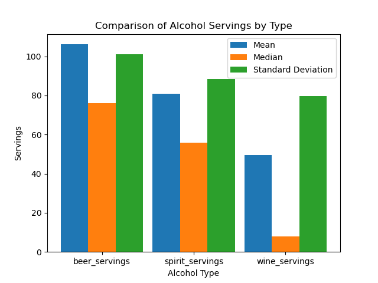

# IDS706 - Mini Project 9 - Ailina Aniwan

## Cloud-Hosted Notebook Data Manipulation

This project demonstrates cloud-hosted data manipulation using a Jupyter Notebook in Google Colab. The project performs descriptive statistical analysis on global alcohol consumption data, leveraging cloud-based resources for computation. The Colab setup ensures accessibility and scalability, making it easier for others to view and reproduce the analysis.

## Instructions for Running in Google Colab

1. Open the notebook directly in Google Colab by clicking on the **Open in Colab** badge above.
2. The notebook will clone the GitHub repository and load the dataset for processing.
3. Run each cell in sequence to view the data analysis and visualizations.

## Project Description
This project analyzes global alcohol consumption using the **drinks.csv** dataset from [FiveThirtyEight](https://github.com/fivethirtyeight/data). It uses Python with **Pandas** for statistical analysis and **Matplotlib** for data visualization to explore the consumption of beer, spirits, and wine across different countries.

## Data Source

The dataset is sourced from [FiveThirtyEight’s alcohol consumption dataset](https://raw.githubusercontent.com/fivethirtyeight/data/master/alcohol-consumption/drinks.csv). It includes the following columns:
- **country**: The country name.
- **beer_servings**: Average beer servings per capita.
- **spirit_servings**: Average spirit servings per capita.
- **wine_servings**: Average wine servings per capita.
- **total_litres_of_pure_alcohol**: Total litres of pure alcohol consumed per capita.

## Descriptive Statistics
- **Mean**: The average number of servings.
- **Median**: The middle value in the data.
- **Standard Deviation**: The variability in servings across countries.

These statistics provide insights into the overall trends and distribution of alcohol consumption.

## Data Visualization

**grouped bar chart** was created to compare the mean, median, and standard deviation for beer, spirits, and wine. This visualization helps identify the central tendencies and spread of alcohol consumption across different categories.

According to the chart:

- **Beer Servings**: Beer has the highest mean and median servings, with relatively low variability (standard deviation).
- **Spirit Servings**: Spirits show high variability, as the standard deviation is almost equal to the mean, indicating greater inconsistency in consumption across countries.
- **Wine Servings**: Wine has the lowest mean and median, but a relatively large standard deviation, indicating that while average consumption is low, there are significant outliers.

